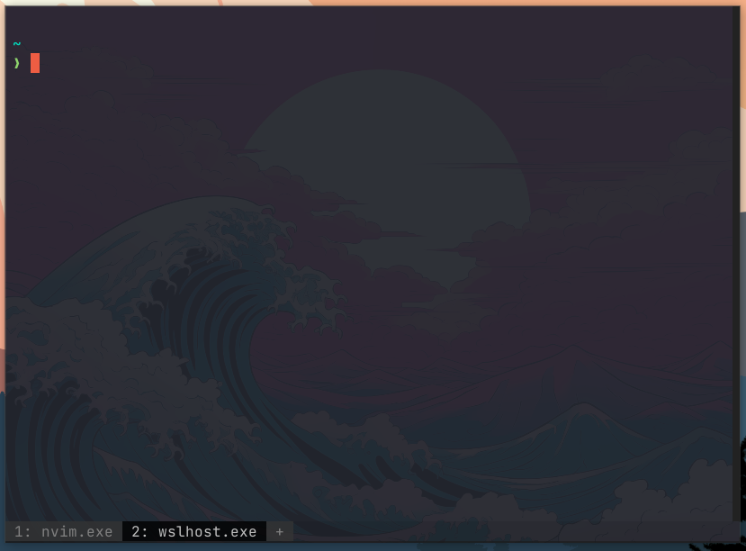

# My dotfiles

I don't have many dotfiles yet, but i used to configure my machines from zero every time i needed to do so. Since i use a Windows desktop with WSL and a MacOS laptop, i thought it was time for me to create my own dotfiles repo. 
As with some other dotfiles, you should create symbolic links to this folder's files to start.
I use certain images that are inside the assets folder, but they are placed independently so this repo isn't that big.

I use wezterm as a multiplatform terminal.
When using zsh (WSL, MacOS, and other linux distros) I use oh-my-zsh and starship. In git bash i use oh-my-posh.
